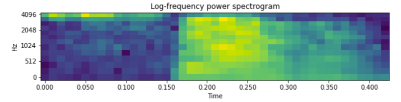
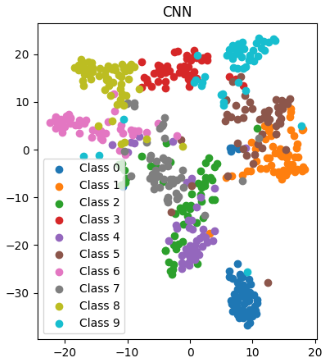

# Speaker-Independent-Spoken-Digit-Recognition
Final project of the course Neural Network Theory and Implementation. The project is a classification problem of several speakers speaking digits. The model classifies the audio sample (of speakers speaking digits) into values from 0-9. The model is to be agnostic to the speaker when recognizing the spoken digit. The audio data samples are converted into Mel spectrograms to make it easier to feed them to neural network models. An example of a Mel spectrogram for an audio sample is shown below.


In the study,
- We study the effect of different data augmentation techniques, both in time domain and frequency domain (SpecAugmentation and Jittering)
- We create a baseline model using a simple regression approach and compare it against models designed for time sequence data such as: RNN, LSTM and temporal 1D Convolutions.
- Analyse the results using metrics such as F1 score, and confusion matrix. Visualize the data clustering using t-sne.
<p align="center">
  
</p>

- We create another model using a self-supervised approach using a contrastive loss function and compare it against the supervised methods.

For more details, refer to the "report.pdf" attached in the repo. To replicate the results,

```
pip install -r requirements.txt
```
To run the experiments, use the provided notebook: "Experiments.ipynb". The required data is provided in "speech_data" folder.

## References
1. Ting Chen, Simon Kornblith, Mohammad Norouzi, and
Geoffrey Hinton. 2020. A simple framework for
contrastive learning of visual representations. In
Proceedings of the 37th International Conference
on Machine Learning, volume 119 of Proceedings
of Machine Learning Research, pages 1597–1607.
PMLR.
2. [Facebook research: Wav Augment](https://github.com/facebookresearch/WavAugment)
3. [Google research: SpecAugment](https://blog.research.google/2019/04/specaugment-new-data-augmentation.html)